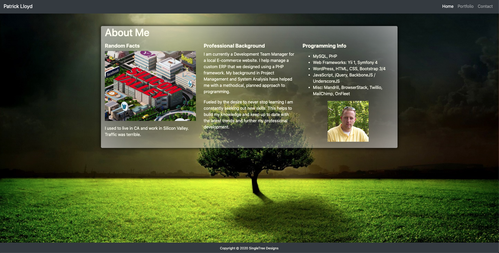

# Responsive Portfolio Design

## General info
Using the Bootstrap framework I created a mobile responsive portfolio.

## Features

* Responsive design optimized for mobile.
* Portfolio page with modal pop ups for more info.
* Changed grid background and text color based on screen size.
* Using Bootstrap removed some items from mobile view.
* Sticky footer.

	
## Technologies
Project is created with:
* Bootstrap 4
* CSS
* HTML

